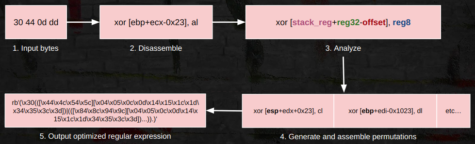

## Coderex: Regular Expressions for Code

<picture>
  <source media="(prefers-color-scheme: dark)" srcset="/images/coderex-dark.jpg">
  <source media="(prefers-color-scheme: light)" srcset="/images/coderex-light.jpg">
  
</picture>


This tool was introduced at the Botconf 2024 conference. It was featured in the workshop **"Writing Configuration Extractors: Navigating Challenges in Extracting Malware Artifacts"** presented by Souhail Hammou and Miroslav Stampar.

### Overview

Manually crafting regexes for compiled code will sometimes fail against new builds that have slight modifications, like different registers or offsets, breaking detection patterns as a result. This increases technical debt which could be avoided altogether if these variations were taken into account when initially writing the regular expression, with the downside that such a process could take a lot of time. 

Coderex is an experimental project made to tackle these issues for x86 and x86-64 instruction sets through automated regex generation. It relies on the iced disassembler/assembler to analyze instructions then re-assemble permutations by replacing registers/offsets. The resulting bytes are fed into a basic regex optimizer that outputs a Python-compatible regular expression. Coderex pays close attention to the nuances of the x86 and x86-64 instruction sets to make the regex more resilient to code changes, it:

- Wildcards call targets.

- Wildcards direct memory accesses. 

- Only wildcards displacements above or equal to the base address to avoid removing structure offsets: [esi\*4+0x104] vs. [esi\*4+0x00408020]. Override code/memory base with ``-d`` e.g. ``-d 0x100``.

- Generates both 'short' and 'near' encodings for branching instructions and wildcards the branch target.

- Identifies stack usage: Wildcards stack frame offsets and accounts for usage of RBP/EBP and RSP/ESP (fpo optimization). The size of the stack frame is also considered as it can vary and affect the encoding of the instruction.

- Supports multiple encodings that a single instruction can have. For instance, an assembler may generate one of two encodings when assembling the instructions below:

```
89 c6	mov    esi, eax	; MOV r/m32 , r32
8b f0	mov    esi, eax	; MOV r32   , r/m32
```

```
05 34 12 00 00          add    eax,0x1234
81 c0 34 12 00 00       add    eax,0x1234
```

### Workflow

 

### Project setup

In a Python 3 virtual environment:

```
$ git clone https://github.com/intel471/coderex.git
$ pip install ./coderex
```

### Usage

To use Coderex you will need to provide hex-encoded code, its start address (defaults to `0x100000`) and specify the architecture (x86 or x64).

```bash
coderex  -c "<hex-encoded instructions>"  [-a "<architecture>"] [-d "<start address>"]
```

For more details please see the output of ``coderex -h``.

### Examples

#### Example 1

To generate a regex for the following x86 code:

```
E8 09 35 F4 FF          	call    sub_44F0B0
83 C6 60               		add     esi, 60h
3B F7                   	cmp     esi, edi
75 F2                   	jnz     short loc_x
```

We run coderex with the following:

```
coderex -c E80935F4FF83C6603BF775F2
```

We can omit the architecture option since x86 is the default. This results in:


```python
regex = re.compile(
    (
        # call 0004350Eh ; '.{5}'
        rb'(\xe8....)'
        # add esi,60h ; '.{3}'
        rb'(\x83[\xc0-\xc3\xc6\xc7]\x60)'
        # cmp esi,edi ; '.{2}'
        rb'([\x39\x3b][\xc1-\xc3\xc6-\xc8\xca\xcb\xce-\xd1\xd3\xd6-\xda\xde\xdf\xf0-\xf3\xf7-\xfb\xfe])'
        # jne short 000FFFFEh ; '.{2,6}'
        rb'((\x75|(\x0f\x85...)).)'
    ), re.DOTALL
)
```

Each line in the string is the regular expression representing the instruction. The comment preceding each line contains the original disassembly of the instruction and its minimum/maximum size for wildcarding.

#### Example 2

To generate a regex for the following x64 instruction:

```
4C 8B 0D 8C 9C 02 00    mov     r9, cs:qword_18002B670
```

We run coderex with the following:

```bash
coderex -c "4C 8B 0D 8C 9C 02 00" -a x64
```

The output:

```python
regex = re.compile(
    (
        # mov r9,[129C93h] ; '.{7}'
        rb'((\x48\x8b[\x05\x0d\x15\x1d\x2d\x35\x3d]|\x4c\x8b[\x05\x0d\x15\x1d\x25\x2d\x35\x3d])....)'
    ), re.DOTALL
)
```

Coderex can generate long and complex expressions which you'll usually need to tweak in order to add in groups or wildcard immediates/offsets. A few helpful regex visualizers: 

- https://regexper.com/
- https://www.debuggex.com/

### Reporting a bug

If you encounter a bug while using Coderex, you're welcome to open a Github issue or reach out to me (see: [Contact](#contact)).

To ensure issues are reproduced and addressed efficiently, we'd like you to provide us with the following information at least:

- The full command used to run Coderex, including all arguments.
- In case of an erroneous regular expression output, the incorrect pattern that was generated.
- In case of a crash, the exception trace.

### Credits

- iced: https://github.com/icedland/iced

### Contact

- Twitter: [@Dark_Puzzle](https://twitter.com/Dark_Puzzle) 
- Email: shammou (at) intel471 (dot) com

### License

Distributed under the GNU AGPLv3 License. See ``LICENSE.txt`` for more information.
